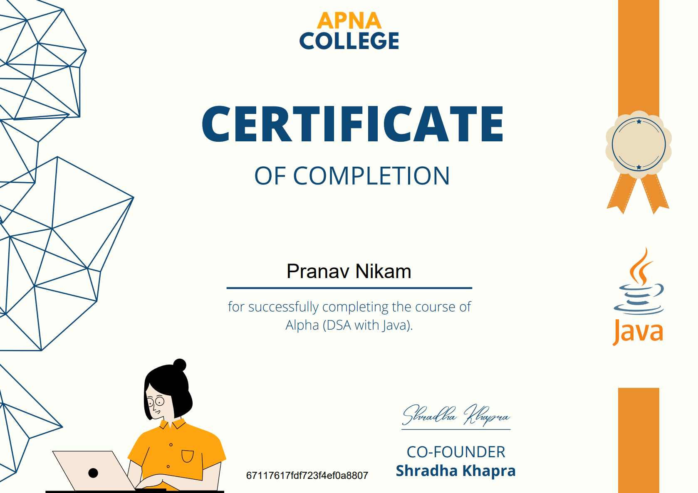
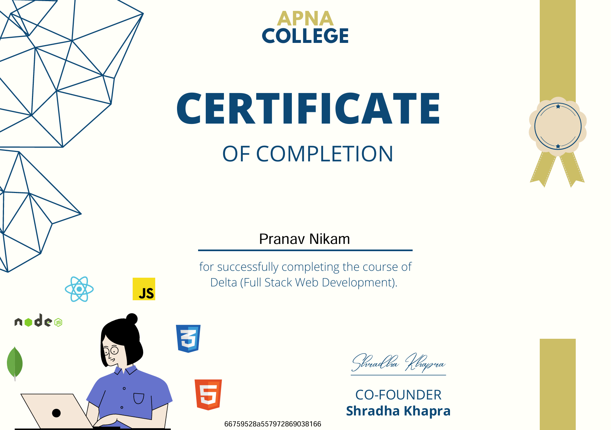

<!-- Profile Header -->

# 👋 Hi there, I'm Pranav Nikam!

---

### 💻 Building the web: **Front-end** ➜ **Back-end**
🌱 Currently learning **Data Science** & Machine Learning  
🔥 Focused on Full Stack Development and Problem Solving

---

## 🛠 Languages and Tools

  
  
  
  
  
  
  
  
  
  
  
  
  
  
  

## 📫 Connect With Me

  
  
  
  

## 📊 GitHub Stats

  

  

  

---

## 🏆 GitHub Trophies

  

## 🐍 GitHub Contributions

  <picture>
    <source media="(prefers-color-scheme: dark)" srcset="https://raw.githubusercontent.com/PranavNikam-15/PranavNikam-15/output/github-snake-dark.svg" />
    <source media="(prefers-color-scheme: light)" srcset="https://raw.githubusercontent.com/PranavNikam-15/PranavNikam-15/output/github-snake.svg" />
    
  </picture>

---

## 📄 Certifications

<table align="center">
  <tr>
    <!-- Alpha DSA Certificate -->
    <td align="center" style="padding: 20px;">
      
       
      <b style="font-size: 16px;">Alpha – DSA with Java</b> 
      <i style="color: #777;">Apna College · Instructor: Shradha Khapra</i>
    </td>
    <!-- Sigma MERN Certificate -->
    <td align="center" style="padding: 20px;">
      
       
      <b style="font-size: 16px;">Sigma – Full Stack Web Dev</b> 
      <i style="color: #777;">Apna College · Instructor: Shradha Khapra</i>
    </td>
  </tr>

  <!-- Udemy Python Bootcamp -->
  <tr>
    <td align="center" colspan="2" style="padding-top: 30px;">
      
       
      <b style="font-size: 16px;">Complete Python Bootcamp 2025</b> 
      <i style="color: #777;">Udemy · Instructor:
        <a href="https://github.com/CodeWithHarry" target="_blank">Haris Ali Khan (CodeWithHarry)</a></i> 
      🔗 <a href="https://www.udemy.com/certificate/UC-a9e6c28b-dbce-4150-acb0-af15397ac0f8/" target="_blank">
        View Certificate on Udemy</a>
    </td>
  </tr>
</table>
