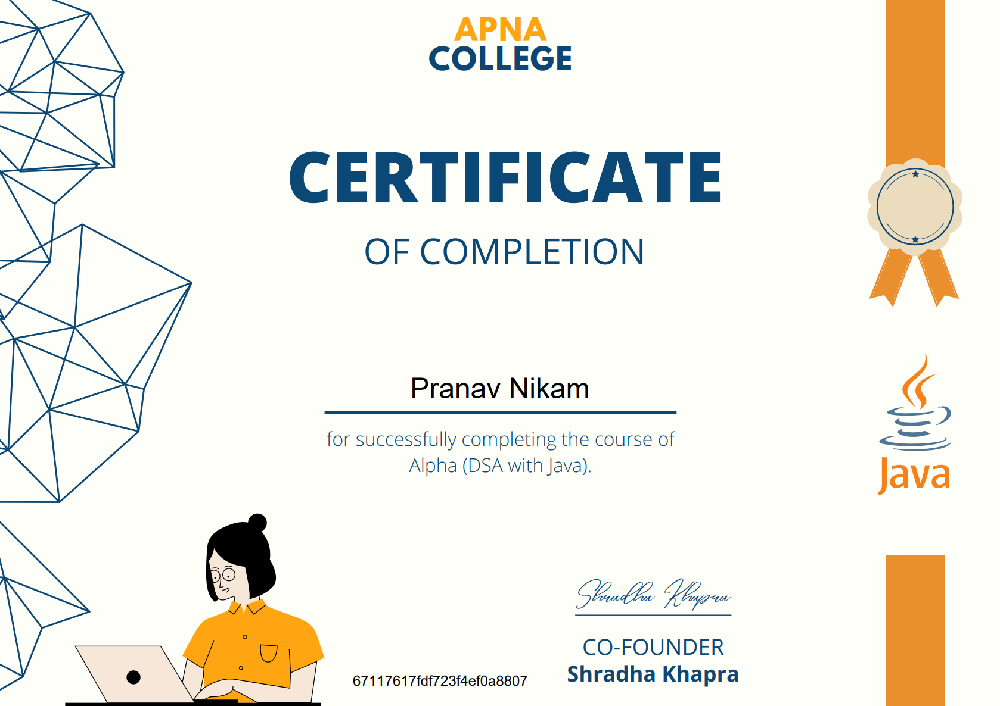
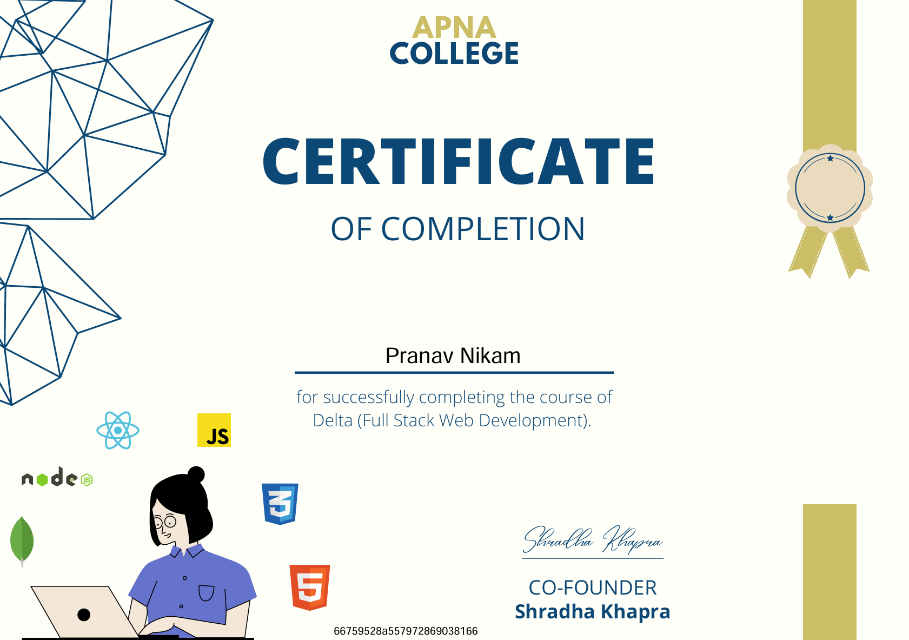
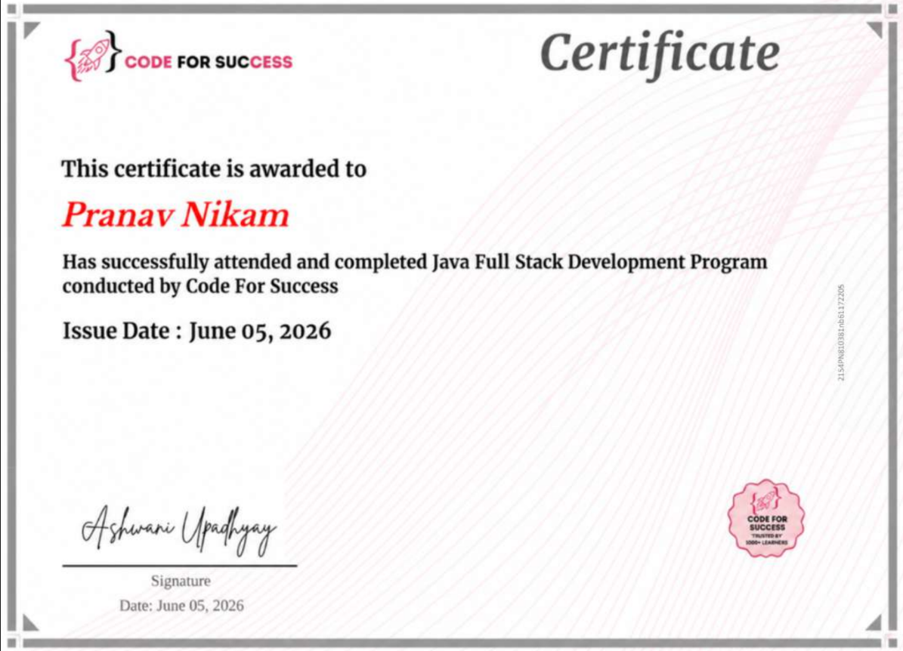
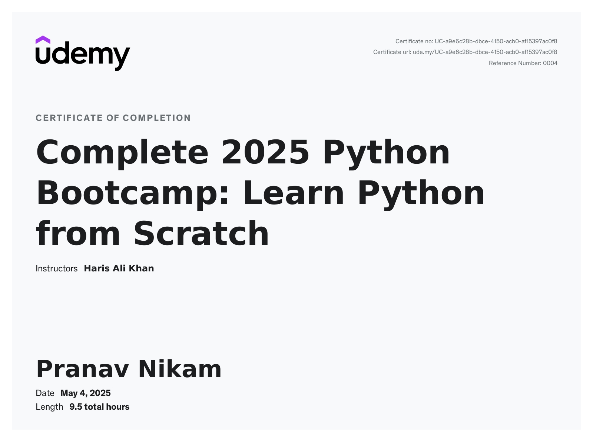

<!--
 

-->

---

### 🚀 About Me

- 💻 Building the web end‑to‑end — **Front‑end ➜ Back‑end**
- 🌱 Currently learning **Data Science** & **Machine Learning**
- 🔥 Focused on **Full Stack Development**, **Spring‑based backends**, and problem solving
- ☁️ Exploring **Microservices**, containerization, and cloud‑native tooling
- 🤝 Open to collaborating on interesting web & data projects
- 📫 Reach me at 

  
  
  

---

### 🛠 Languages & Tools

  
  
  
  

  
  
  
  
  

  
  
  
  
   
  
  
  

  
  
  
  

  
  
  

---

### 📊 GitHub Stats

  

---

<!--
 
### 🐍 Contribution Graph

  <picture>
    <source media="(prefers-color-scheme: dark)" srcset="https://raw.githubusercontent.com/PranavNikam-15/PranavNikam-15/output/github-snake-dark.svg" />
    <source media="(prefers-color-scheme: light)" srcset="https://raw.githubusercontent.com/PranavNikam-15/PranavNikam-15/output/github-snake.svg" />
    
  </picture>

-->

### 📄 Certifications

<table align="center">
  <tr>
    <td align="center" width="50%">
      
       <b>DSA with Java</b>
    </td>
    <td align="center" width="50%">
      
       <b>Full Stack Web Dev</b>
    </td>
  </tr>
  <tr>
    <td align="center" width="50%">
      
       <b>Java Backend Development</b>
    </td>
    <td align="center" width="50%">
      
       <b>Python Bootcamp</b>
    </td>
  </tr>
</table>

